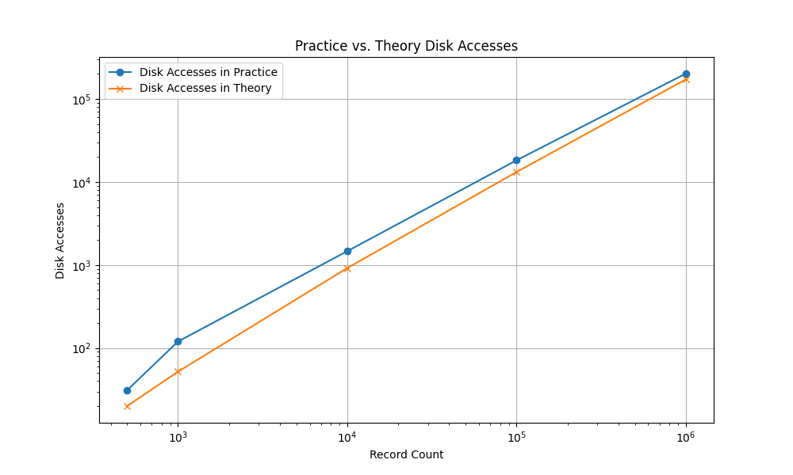

# Sprawozdanie z projektu: Sortowanie pliku metodą scalania z wykorzystaniem dużych buforów
Benjamin Jurewicz s198326

## 1. Wprowadzenie i opis problemu

### 1.1. Założenia projektowe
Głównym zadaniem projektu było opracowanie programu realizującego sortowanie pliku danych przy użyciu metody scalania z wykorzystaniem dużych buforów. Program musiał uwzględniać symulację blokowego odczytu danych oraz oferować elastyczne metody wprowadzania danych testowych.

### 1.2. Charakterystyka algorytmu
Wykorzystana technika bazuje na standardowym sortowaniu przez scalanie, jednak została zmodyfikowana w celu obsługi sparametryzowanej liczby buforów, a nie tylko dwóch. Aby zoptymalizować proces wyboru najmniejszego elementu spośród $n$ dostępnych buforów, zastosowano kolejkę priorytetową.

Proces sortowania podzielony jest na dwa etapy:

**Etap I: Generowanie ciągów początkowych**
1.  Wczytanie z pliku wejściowego $nb$ rekordów (gdzie $b$ to współczynnik blokowania – *blocking factor*, a n to liczba buforów).
2.  Posortowanie pobranych danych w pamięci operacyjnej szybkim algorytmem (np. *Quicksort*, *MergeSort* itp.).
3.  Zapisanie utworzonego ciągu na dysk. Kroki te są powtarzane aż do wyczerpania pliku źródłowego.

**Etap II: Scalanie ciągów** 
1.  Scalanie $n-1$ ciągów przy użyciu $n$-tego bufora jako wyjścia i zapis wyniku na dysk.
2.  Powtarzanie procesu dla całego pliku.
3.  Kontynuowanie faz scalania aż do momentu, gdy w pliku pozostanie pojedynczy, całkowicie posortowany ciąg.

Kluczowym aspektem wydajności jest dobór liczby buforów w taki sposób, aby zminimalizować liczbę faz, co przekłada się na mniejszą liczbę kosztownych operacji wejścia/wyjścia.

### 1.3. Specyfikacja danych
W programie rekordem jest ciąg znaków ASCII o maksymalnej długości 30 bajtów. Porządek sortowania jest leksykograficzny (słownikowy).

Format pliku jest binarny:
* Każdy rekord jest rozszerzany znakami '\0' do rozmiaru 30 bajtów.
* Pomiędzy rekordami nie występują żadne dodatkowe separatory.

## 2. Szczegóły implementacyjne

Implementacja składa się z dwóch niezależnych programów wykonawczych, które wspólnie realizują proces przygotowania i sortowania danych.

### 2.1. Program generowania danych (`create_files`)

Pierwszy moduł odpowiada za tworzenie plików testowych z danymi wejściowymi. Oferuje następujące możliwości:

* **Generowanie losowych rekordów** (opcja `-r`): Pozwala na automatyczne wypełnienie pliku określoną liczbą losowo wygenerowanych ciągów znaków. Parametr przyjmuje liczbę rekordów do wygenerowania.
* **Tryb numeryczny** (opcja `-n`): W połączeniu z trybem losowym umożliwia generowanie wyłącznie wartości liczbowych, co upraszcza weryfikację poprawności sortowania.
* **Określenie pliku wyjściowego** (opcja `-f`): Umożliwia wskazanie ścieżki do pliku docelowego. Domyślnie dane zapisywane są do `data/data.bin`.
* **Tryb interaktywny** (opcja `-i`): Pozwala na wprowadzanie rekordów bezpośrednio z klawiatury, co jest przydatne przy testowaniu szczególnych przypadków brzegowych.

### 2.2. Program sortujący (`sort_files`)

Drugi moduł realizuje właściwe sortowanie metodą scalania. Przyjmuje jako argument obowiązkową ścieżkę do pliku, który ma zostać posortowany, oraz opcjonalne parametry konfiguracyjne:

* **Liczba buforów** (opcja `-n`): Określa ilość buforów wykorzystywanych podczas sortowania. Minimalna wartość to 3, domyślnie ustawione jest 5 buforów. Parametr ten bezpośrednio wpływa na liczbę faz scalania i efektywność algorytmu.
* **Współczynnik blokowania** (opcja `-b`): Definiuje liczbę rekordów mieszczących się w pojedynczym bloku dyskowym. Minimalna wartość wynosi 1, domyślnie stosowany jest współczynnik 10. Większe wartości redukują liczbę operacji dyskowych poprzez grupowanie rekordów.
* **Kontrola logowania** (opcja `-l`): Wyłącza szczegółowe komunikaty diagnostyczne podczas działania programu.

## 3. Analiza eksperymentalna

### 3.1. Cel eksperymentu
Celem eksperymentu była weryfikacja wpływu ilości danych na liczbę operacji wejścia/wyjścia dla określonej liczby buforów.

* **Stałe parametry:** 
  * Współczynnik blokowania $b = 50$.
  * Liczba buforów: $n=10$
* **Zmienne parametry:**
    * Wielkość danych: kolejno 500, 1000, 10 000, 100 000, 1 000 000

### 3.2. Wyniki i wnioski
Analiza zgromadzonych danych pozwala na sformułowanie następujących obserwacji:

1.  **Liczba faz:** Rośnie ona w sposób logarytmiczny wraz ze wzrostem liczby rekordów. Liczba faz w eksperymencie pokrywa się w 100% z modelem teoretycznym.
2. **Liczba operacji dyskowych:** Również rośnie logarytmicznie, jednakże rzeczywiste wartości są wyższe niż przewidywane przez uproszczony model teoretyczny.
3.  **Zgodność z teorią:**
    * Standardowy wzór przybliżony z literatury ($2 \frac{N}{b} \log_n \frac{N}{b}$) zaniża wyniki, głównie ze względu na niedokładną podstawę logarytmu.




## 4. Podsumowanie
Metoda sortowania przez scalanie z wykorzystaniem dużych buforów jest efektywnym rozwiązaniem dla danych dostępnych sekwencyjnie. 

---

## 5. Dane
```
500:
Generate command: ./out/create_files -r 500 -f "temp/t"
Sort command: ./out/sort_files -b 50 -n 10 "temp/t" -l
Write Count: 10
Read Count: 21
Sum: 31
Phases Needed Actual: 0
Phases Needed Theory: 0

1000:
Generate command: ./out/create_files -r 1000 -f "temp/t"
Sort command: ./out/sort_files -b 50 -n 10 "temp/t" -l
Write Count: 40
Read Count: 80
Sum: 120
Phases Needed Actual: 1
Phases Needed Theory: 1

10000:
Generate command: ./out/create_files -r 10000 -f "temp/t"
Sort command: ./out/sort_files -b 50 -n 10 "temp/t" -l
Write Count: 490
Read Count: 980
Sum: 1470
Phases Needed Actual: 2
Phases Needed Theory: 2

100000:
Generate command: ./out/create_files -r 100000 -f "temp/t"
Sort command: ./out/sort_files -b 50 -n 10 "temp/t" -l
Write Count: 6090
Read Count: 12180
Sum: 18270
Phases Needed Actual: 3
Phases Needed Theory: 3

1000000:
Generate command: ./out/create_files -r 1000000 -f "temp/t"
Sort command: ./out/sort_files -b 50 -n 10 "temp/t" -l
Write Count: 67380
Read Count: 134760
Sum: 202140
Phases Needed Actual: 4
Phases Needed Theory: 4
```